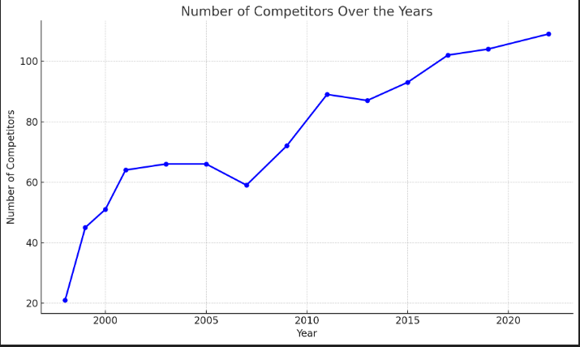
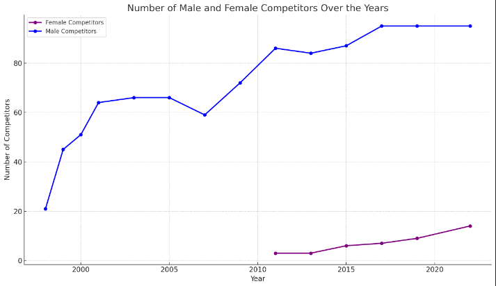
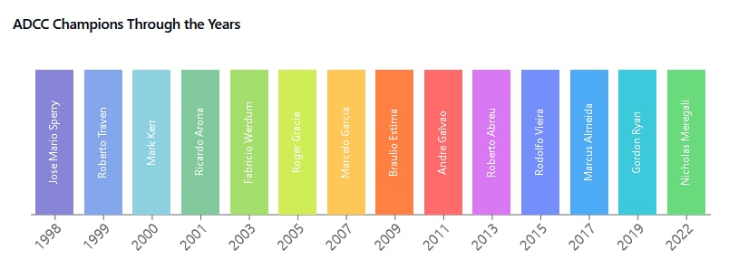

# Brazilian Jiu-Jitsu Competition Analysis 🥋
Welcome to the Brazilian Jiu-Jitsu (BJJ) Competition Analysis repository! This project explores key trends in BJJ competitions, including participant growth, submission trends, and the rise of top athletes. Dive into the data to see how the sport has evolved over the years, from the number of participants to the techniques used in matches.

## Key Findings 📊
1. Increasing Participation and Popularity 🎉
Growing Interest: There's been a general increase in the number of competitors, showcasing a growing passion for BJJ.
Peak Participation: 2022 saw 109 competitors, marking a peak, although fluctuations existed in earlier years (e.g., drops between 2007 and 2009).
Early Growth: Between 1998 to 2001, the event saw rapid growth, reflecting its increasing popularity after its early years. Stabilization: From 2003 to 2013, the number of competitors stabilized at around 60-90 participants, signaling a mature but steady interest.

    

2. Gender Trends and Inclusivity 🌸
Rise in Female Participation: Female competitors increased from 3 participants in 2011 and 2013 to 14 in 2022, indicating a growing inclusivity.
Male Consistency: Male participation remained strong, with 95 competitors in 2022, showing a steady interest.
Male to Female Ratio: In 2022, the male-to-female ratio was 7:1 (95 males to 14 females), suggesting potential for future growth in female participation.

    

3. Submission Trends Over Time 🔥
Rear Naked Choke (RNC): This submission has dominated over the years, with peak years in 2005, 2009, and 2022. Its consistency reflects its enduring effectiveness.
Rise of Heel Hooks: Heel hooks became increasingly popular after 2011, particularly peaking in 2013 and 2015—indicating a shift towards leg-lock techniques.
Submission Growth: The number of submissions steadily increased, with 40 submissions recorded in 2022, the highest in the dataset.
4. Top Performers 🏆
Dominant Athletes: The top athletes who have consistently performed include Alexandre Ribeiro (30 wins), Marcelo Garcia (27 wins), and Andre Galvao (22 wins).
New Faces: Emerging athletes like Kaynan Duarte and Kron Gracie, with 8 wins, are beginning to make their mark on the sport.
Veterans: Well-known names like Royler Gracie and Ricardo Arona, with 12-13 wins, continue to be competitive despite the rise of new talent.
## Conclusions 📝
Increased Competitor Participation: The data illustrates a growing interest in Brazilian Jiu-Jitsu, particularly among female competitors, who have shown a consistent rise over the years.
Evolution of Submission Techniques: Traditional submissions like Rear Naked Choke remain popular, but there’s a clear shift toward leg locks, including heel hooks.
Consistent High Performers: Athletes like Gordon Ryan and Marcus Almeida have shown remarkable consistency, while newer athletes are starting to create a significant impact.
As BJJ continues to evolve, the rise of new techniques and fresh talent will shape the sport's future!

## Contribute to the Project ✨
If you have additional insights or data on Brazilian Jiu-Jitsu competitions, feel free to contribute! Fork the repository, make improvements, and submit a pull request. Let’s continue to grow and develop this awesome sport together! 💥.

